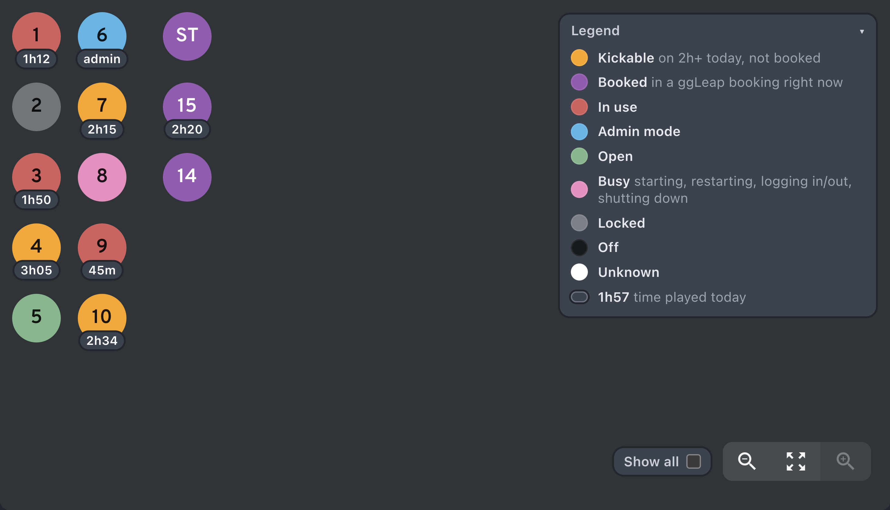

# Uptime Badges for ggLeap

A Chrome extension that labels each PC bubble on the admin.ggleap.com device dashboard with how long the current player has played today, and colors kickable PCs.



*Mock data.* Bubble colors follow `/pcs`:

- **orange** = kickable: 2h+ today and not in a current ggLeap booking
- **purple** = in a current booking
- **red** = in use
- **cyan** = admin mode
- **green** = open
- **pink** = busy: starting, logging in/out, shutting down. ggLeap's own orange-yellow is recolored so it can't be mistaken for kickable.
- **gray** = locked
- **dark gray** = off

Pills show time played today (`1h57`, `45m`). ggLeap's green PC-health ring is hidden. Every color can be changed from the extension's toolbar button (see [Changing colors](#changing-colors)).

The layout matches the room: desks 1–5 and 6–10 as two columns, then stream / 15 / 14. Test PCs and anything else hide behind the **Show all** checkbox next to the zoom buttons. A collapsible **Legend** in the top-right corner explains the colors. Both settings are remembered per browser.

## Install in Chrome

Requires Chrome 111 or newer. Other Chromium browsers (Edge, Brave, Arc) work the same way through their own extensions page.

1. **Download the code.** On this repo's GitHub page, click the green **Code** button → **Download ZIP**, then unzip it. Or clone it:
   ```sh
   git clone https://github.com/aiden-lee11/better-ggleap.git
   ```
   Put the folder somewhere you won't delete it. Chrome loads the extension from that folder every time it starts.
2. **Open the extensions page.** Go to `chrome://extensions` in the address bar.
3. **Turn on Developer mode** with the toggle in the top-right corner.
4. **Click Load unpacked** (top left) and select the folder that contains `manifest.json`. If you downloaded the ZIP, that's the `better-ggleap-main` folder inside the unzipped download.
5. **Refresh any open ggLeap tabs.** The extension only starts on pages loaded after it's installed.
6. Open https://admin.ggleap.com, sign in, and go to the **Dashboard**. The device dashboard should show time badges, the new colors and the legend.

Optional: click the puzzle-piece icon in Chrome's toolbar and pin **Uptime Badges for ggLeap** so its button is always visible.

### Changing colors

Click the extension's toolbar button to open **Bubble colors**. Click any state's circle (Kickable, Booked, In use, Busy, etc.) to pick a new color. Open ggLeap tabs update right away, including the legend. Label text switches between black and white to stay readable.

Your colors are saved in this browser and survive restarts. Use ↺ to reset one state, or **Reset all colors** to go back to the defaults.

### Updating

Download the ZIP again and replace the old folder's contents, or run `git pull` in your clone. Then click the reload icon on the extension's card in `chrome://extensions` and refresh the ggLeap tab.

### Not seeing anything?

- Refresh the ggLeap tab. Tabs that were open before the install don't get the extension.
- In `chrome://extensions`, make sure the extension is switched on and has no red **Errors** button.
- On the ggLeap tab, open DevTools (⌘⌥J on Mac, Ctrl+Shift+J on Windows) and type `__ggUptime` in the Console. If it says `undefined`, the extension isn't running on that page. Reload it in `chrome://extensions` and refresh the tab.
- Badges only appear on PCs someone is using. If every PC is off or open, the dashboard is correctly blank apart from the colors and legend.

### Building a zip for the Chrome Web Store

Run `./package.sh`, which writes `dist/uptime-badges-for-ggleap-<version>.zip`. You only need this to upload to the store, not to install.

## Publish

See [STORE_LISTING.md](STORE_LISTING.md) for every field in the Chrome Web Store dashboard, and [PRIVACY.md](PRIVACY.md) for the privacy policy it asks for. Upload the zip from `./package.sh`. Bump `version` in `manifest.json` before each new upload.

## How it works

The extension reuses your own admin session. It copies the auth headers from the page's requests to `api.ggleap.com` (or falls back to `localStorage.jwt_token`). It reads `machines_list_requests` and `get_bookings`, and fetches `user_activity_graph_requests` (TimePlayed, today in Central time) for each logged-in PC. That's the same data the old `/pcs` command used. It only reads; it never changes anything in ggLeap.

Files: `content.js` runs in the page and draws everything. `states.js` lists every bubble state and its default color. `colors.js` applies colors saved from the popup (`popup.html`/`popup.js`) as CSS variables.

Badges attach inside each `glp-pc-layout-pc-item`, matched by its `aria-label` (e.g. `009`, `TS`). Positions are rescaled from the bubble's size, so the layout survives ggLeap's zoom. If the play-time request fails, the badge falls back to time since the machine's `LastStateUpdate`. Debug state: `window.__ggUptime` in DevTools.
